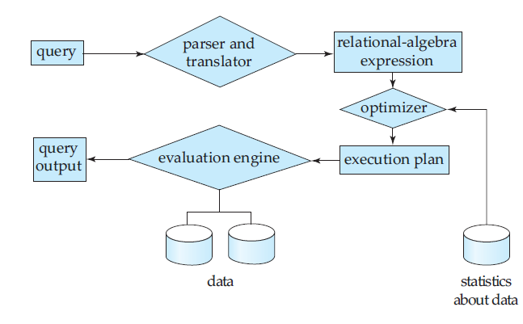
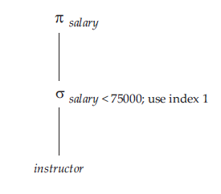

# Overview 

The steps involved in processing a query appear in Figure 12.1. The basic steps  are:

1. Parsing and translation.
2. Optimization. 
3. Evaluation. 

Before query processing can begin, the system must translate the query into a usable form. A language such as SQL is suitable for human use, but is ill suited to be the system’s internal representation of a query. A more useful internal representation is one based on the extended relational algebra.

Thus, the first action the system must take in query processing is to translate a given query into its internal form. This translation process is similar to the work performed by the parser of a compiler. In generating the internal form of the query, the parser checks the syntax of the user’s query, verifies that the relation names appearing in the query are names of the relations in the database, and so on. The system constructs a parse-tree representation of the query, which it then translates into a relational-algebra expression. If the query was expressed in terms of a view, the translation phase also replaces all uses of the view by the relational-algebra expression that defines the view.1 Most compiler texts cover parsing in detail.

**Figure-12.1 Steps in query processing**

Given a query, there are generally a variety of methods for computing the answer. For example, we have seen that, in SQL, a query could be expressed in several different ways. Each SQL query can itself be translated into a relationalalgebra expression in one of several ways. Furthermore, the relational-algebra representation of a query specifies only partially howto evaluate a query; there are usually several ways to evaluate relational-algebra expressions. As an illustration, consider the query:

select salary
from instructor
where salary < 75000;

This query can be translated into either of the following relational-algebra expressions:

-salary <75000 (salary (instructor))
-salary (salary<75000 (instructor))

Further, we can execute each relational-algebra operation by one of several different algorithms. For example, to implement the preceding selection, we can search every tuple in instructor to find tuples with salary less than 75000. If a B+-tree index is available on the attribute salary, we can use the index instead to locate the tuples.

To specify fully how to evaluate a query, we need not only to provide the relational-algebra expression, but also to annotate it with instructions specifying how to evaluate each operation. Annotations may state the algorithm to be used

**Figure-12.2 A query-evaluation plan.**

for a specific operation, or the particular index or indices to use. A relationalalgebra operation annotated with instructions on how to evaluate it is called an evaluation primitive. A sequence of primitive operations that can be used to evaluate a query is a query-execution plan or query-evaluation plan. Figure 12.2 illustrates an evaluation plan for our example query, in which a particular index (denoted in the figure as “index 1”) is specified for the selection operation. The query-execution engine takes a query-evaluation plan, executes that plan, and returns the answers to the query.

The different evaluation plans for a given query can have different costs. We do not expect users to write their queries in a way that suggests the most efficient evaluation plan. Rather, it is the responsibility of the system to construct a queryevaluation plan that minimizes the cost of query evaluation; this task is called query optimization. Chapter 13 describes query optimization in detail.

Once the query plan is chosen, the query is evaluated with that plan, and the result of the query is output.

The sequence of steps already described for processing a query is representative; not all databases exactly follow those steps. For instance, instead of using the relational-algebra representation, several databases use an annotated parsetree representation based on the structure of the given SQL query. However, the concepts that we describe here form the basis of query processing in databases.

In order to optimize a query, a query optimizer must know the cost of each operation. Although the exact cost is hard to compute, since it depends on many parameters such as actual memory available to the operation, it is possible to get a rough estimate of execution cost for each operation.

In this chapter we study how to evaluate individual operations in a query plan, and how to estimate their cost; we return to query optimization in Chapter 13. Section 12.2 outlines how we measure the cost of a query. Sections 12.3 through 12.6 cover the evaluation of individual relational-algebra operations. Several operations may be grouped together into a pipeline, in which each of the operations starts working on its input tuples even as they are being generated by another operation. In Section 12.7, we examine how to coordinate the execution of multiple operations in a query evaluation plan, in particular, how to use pipelined operations to avoid writing intermediate results to disk.