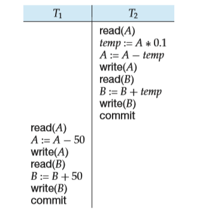
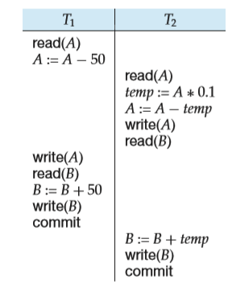

# Transaction Isolation

Transaction-processing systems usually allow multiple transactions to run con- currently. Allowing multiple transactions to update data concurrently causes several complications with consistency of the data, as we saw earlier. Ensuring consistency in spite of concurrent execution of transactions requires extra work; it is far easier to insist that transactions run **serially**—that is, one at a time, each starting only after the previous one has completed. However, there are two good reasons for allowing concurrency:

• **Improved throughput and resource utilization**. A transaction consists of many steps. Some involve I/O activity; others involve CPU activity. The CPU and the disks in a computer system can operate in parallel. Therefore, I/O activity can be done in parallel with processing at the CPU. The parallelism of the CPU and the I/O system can therefore be exploited to run multiple transactions in parallel. While a read or write on behalf of one transaction is in progress on one disk, another transaction can be running in the CPU, while another disk may be executing a read or write on behalf of a third transaction. All of this increases the **throughput** of the system—that is, the number of transactions executed in a given amount of time. Correspondingly, the processor and disk **utilization** also increase; in other words, the processor and disk spend less time idle, or not performing any useful work.

• **Reduced waiting time**. There may be a mix of transactions running on a system, some short and some long. If transactions run serially, a short trans- action may have to wait for a preceding long transaction to complete, which can lead to unpredictable delays in running a transaction. If the transactions are operating on different parts of the database, it is better to let them run concurrently, sharing the CPU cycles and disk accesses among them. Con- current execution reduces the unpredictable delays in running transactions. Moreover, it also reduces the **average response time**: the average time for a transaction to be completed after it has been submitted.

The motivation for using concurrent execution in a database is essentially the same as the motivation for using **multiprogramming** in an operating system.

When several transactions run concurrently, the isolation property may be vi- olated, resulting in database consistency being destroyed despite the correctness of each individual transaction. In this section, we present the concept of sched- ules to help identify those executions that are guaranteed to ensure the isolation property and thus database consistency.

The database system must control the interaction among the concurrent trans- actions to prevent them from destroying the consistency of the database. It does so through a variety of mechanisms called **concurrency-control schemes**. We study concurrency-control schemes in Chapter 15; for now, we focus on the concept of correct concurrent execution.

Consider again the simplified banking system of Section 14.1, which has several accounts, and a set of transactions that access and update those accounts. Let _T_1 and _T_2 be two transactions that transfer funds from one account to another. Transaction _T_1 transfers $50 from account _A_ to account _B_. It is defined as:

T1: read(A);
 A := A − 50;
 write(A);
 read(B);
 B := B\+ 50; write(B).

Transaction T2 transfers 10 percent of the balance from account A to account B. It is defined as:  

**TRENDS IN CONCURRENCY**

Several current trends in the field of computing are giving rise to an increase in the amount of concurrency possible. As database systems exploit this con- currency to increase overall system performance, there will necessarily be an increasing number of transactions run concurrently.

Early computers had only one processor. Therefore, there was never any real concurrency in the computer. The only concurrency was apparent concurrency created by the operating system as it shared the processor among several distinct tasks or processes. Modern computers are likely to have many processors. These may be truly distinct processors all part of the one computer. However even a single processor may be able to run more than one process at a time by having multiple _cores_. The Intel Core Duo processor is a well-known example of such a multicore processor.

For database systems to take advantage of multiple processors and multiple cores, two approaches are being taken. One is to find parallelism within a single transaction or query. Another is to support a very large number of concurrent transactions.

Many service providers now use large collections of computers rather than large mainframe computers to provide their services. They are making this choice based on the lower cost of this approach. A result of this is yet a further increase in the degree of concurrency that can be supported.

The bibliographic notes refer to texts that describe these advances in com- puter architecture and parallel computing. Chapter 18 describes algorithms for building parallel database systems, which exploit multiple processors and mul- tiple cores.

T2: read(A);
    temp := A \* 0.1;
     A := A − temp;
     write(A);
     read(B);
     B := B \+ temp;
     write(B).

Suppose the current values of accounts _A_ and _B_ are $1000 and $2000, respec- tively. Suppose also that the two transactions are executed one at a time in the order _T_1 followed by _T_2\. This execution sequence appears in Figure 14.2. In the figure, the sequence of instruction steps is in chronological order from top to bottom, with instructions of _T_1 appearing in the left column and instructions of _T_2 appearing in the right column. The final values of accounts _A_ and _B_, after the execution in Figure 14.2 takes place, are $855 and $2145, respectively. Thus, the total amount of money in accounts _A_ and _B_—that is, the sum _A_ \+ _B_—is preserved after the execution of both transactions.  

|T1       | T2           |
|---------|--------------|
|read(A)  |              |
|A:=A−50  |              |
|write(A) |              |
|read(B)  |              |
|B:=B\+ 50|              |
|write(B) |              |
| commit  |              |
|         |read(A)       |
|         |temp :=A ∗ 0.1|
|         | A:= A−temp   | 
|         |write(A)      | 
|         |read(B)       |
|         |B:= B + temp  |
|         |write(B)      |
|         |commit        |

**Figure 14.2** Schedule 1—a serial schedule in which _T_1 is followed by _T_2.

Similarly, if the transactions are executed one at a time in the order _T_2 followed by _T_1, then the corresponding execution sequence is that of Figure 14.3. Again, as expected, the sum _A_ \+ _B_ is preserved, and the final values of accounts _A_ and _B_ are $850 and $2150, respectively.

**Figure 14.3** Schedule 2—a serial schedule in which _T_2 is followed by _T_1.  

The execution sequences just described are called **schedules**. They represent the chronological order in which instructions are executed in the system. Clearly, a schedule for a set of transactions must consist of all instructions of those trans- actions, and must preserve the order in which the instructions appear in each individual transaction. For example, in transaction T1, the instruction write(_A_) must appear before the instruction read(_B_), in any valid schedule. Note that we include in our schedules the **commit** operation to indicate that the transaction has entered the committed state. In the following discussion, we shall refer to the first execution sequence (T1 followed by T2) as schedule 1, and to the second execution sequence (T2 followed by T1) as schedule 2.

These schedules are **serial**: Each serial schedule consists of a sequence of instructions from various transactions, where the instructions belonging to one single transaction appear together in that schedule. Recalling a well-known for- mula from combinatorics, we note that, for a set of _n_ transactions, there exist _n_ factorial (_n_!) different valid serial schedules.

When the database system executes several transactions concurrently, the corresponding schedule no longer needs to be serial. If two transactions are running concurrently, the operating system may execute one transaction for a little while, then perform a context switch, execute the second transaction for some time, and then switch back to the first transaction for some time, and so on. With multiple transactions, the CPU time is shared among all the transactions.

Several execution sequences are possible, since the various instructions from both transactions may now be interleaved. In general, it is not possible to predict exactly how many instructions of a transaction will be executed before the CPU switches to another transaction.1

Returning to our previous example, suppose that the two transactions are executed concurrently. One possible schedule appears in Figure 14.4. After this execution takes place, we arrive at the same state as the one in which the transac- tions are executed serially in the order T1 followed by T2\. The sum _A_ \+ _B_ is indeed preserved.

Not all concurrent executions result in a correct state. To illustrate, consider the schedule of Figure 14.5. After the execution of this schedule, we arrive at a state where the final values of accounts _A_ and _B_ are $950 and $2100, respectively. This final state is an _inconsistent state_, since we have gained $50 in the process of the concurrent execution. Indeed, the sum _A_ \+ _B_ is not preserved by the execution of the two transactions.

If control of concurrent execution is left entirely to the operating system, many possible schedules, including ones that leave the database in an inconsistent state, such as the one just described, are possible. It is the job of the database system to ensure that any schedule that is executed will leave the database in a consistent state. The **concurrency-control** component of the database system carries out this task.

1The number of possible schedules for a set of _n_ transactions is very large. There are _n_! different serial schedules. Considering all the possible ways that steps of transactions might be interleaved, the total number of possible schedules is much larger than _n_!.  

**Figure 14.4** Schedule 3—a concurrent schedule equivalent to schedule 1.

We can ensure consistency of the database under concurrent execution by making sure that any schedule that is executed has the same effect as a schedule that could have occurred without any concurrent execution. That is, the schedule should, in some sense, be equivalent to a serial schedule. Such schedules are called **serializable** schedules.

**Figure 14.5** Schedule 4—a concurrent schedule resulting in an inconsistent state.