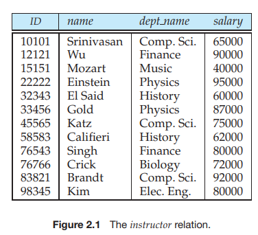
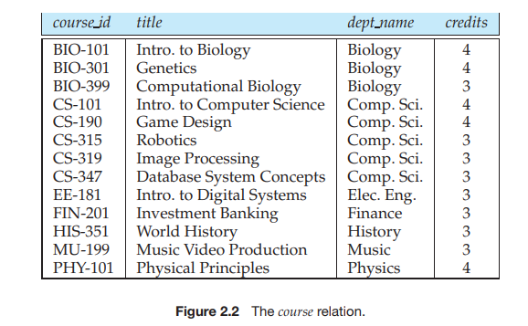
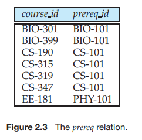

2.1 Structure of Relational Databases## 2.1 Structure of Relational Databases
>>>>>>> 0ecfe74e39ab7cceb756dfe2c8441bdba5f2f6d8

A relational database consists of a collection of **tables**, each of which is assigned a unique name. For example, consider the _instructor_ table of Figure 2.1, which stores information about instructors. The table has four column headers: _ID_, _name_, _dept name_, and _salary_. Each row of this table records information about an instructor, consisting of the instructor’s _ID_, _name_, _dept name_, and _salary_. Similarly, the _course_ table of Figure 2.2 stores information about courses, consisting of a _course id_, _title_, _dept name_, and _credits_, for each course. Note that each instructor is identified by the value of the column _ID_, while each course is identified by the value of the column _course id_.

Figure 2.3 shows a third table, _prereq_, which stores the prerequisite courses for each course. The table has two columns, _course id_ and _prereq id_. Each row consists of a pair of course identifiers such that the second course is a prerequisite for the first course.

Thus, a row in the _prereq_ table indicates that two courses are _related_ in the sense that one course is a prerequisite for the other. As another example, we consider the table _instructor_, a row in the table can be thought of as representing

<<<<<<< HEAD
| _ID_ | _name_ | _dept name_ | _salary_ |
| --- | ---- | ---- | ---- | 
| 10101 | Srinivasan | Comp. Sci. | 65000 |
| 12121  | Wu |Finance |90000 |
|15151 |Mozart |Music |40000 |
|22222 |Einstein |Physics |95000 |
|32343 |El Said |History |60000 |
|33456|Gold |Physics |87000| 
|45565| Katz |Comp. Sci. |75000 |
|58583 |Califieri |History |62000 |
|76543 |Singh |Finance |80000 |
|76766|Crick |Biology |72000| 
|83821| Brandt |Comp. Sci. |92000 |
|98345 |Kim |Elec. Eng. |80000|

**Figure 2.1** The _instructor_ relation.
=======

>>>>>>> 0ecfe74e39ab7cceb756dfe2c8441bdba5f2f6d8

the relationship between a specified _ID_ and the corresponding values for _name_, _dept name_, and _salary_ values.

In general, a row in a table represents a _relationship_ among a set of values. Since a table is a collection of such relationships, there is a close correspondence between the concept of _table_ and the mathematical concept of _relation_, from which the relational data model takes its name. In mathematical terminology, a _tuple_ is simply a sequence (or list) of values. A relationship between _n_ values is repre- sented mathematically by an _n-tuple_ of values, i.e., a tuple with _n_ values, which corresponds to a row in a table.

<<<<<<< HEAD
|_-course id_ |_title_ |_dept name_ |_credits_|
| ---- | ---- | ---- | ---- |
|BIO-101 |Intro. to Biology |Biology |4 |
|BIO-301 |Genetics |Biology |4| 
|BIO-399 |Computational Biology|Biology| 3 |
|CS-101|Intro. to Computer Science |Comp. Sci. |4| 
|CS-190| Game Design |Comp. Sci. |4| 
|CS-315| Robotics |Comp. Sci. |3| 
|CS-319| Image Processing |Comp. Sci. |3| 
|CS-347 |Database System Concepts |Comp. Sci. |3| 
|EE-181 |Intro. to Digital Systems |Elec. Eng. |3| 
|FIN-201 |Investment Banking |Finance|3| 
|HIS-351 |World History |History| 3| 
|MU-199 |Music Video Production |Music |3| 
|PHY-101 |Physical Principles |Physics |4|

**Figure 2.2** The _course_ relation.  

|_course id_ |_prereq id_|
| --- | --- |
|BIO-301 |BIO-101 |
|BIO-399 |BIO-101 |
|CS-190 |CS-101 |
|CS-315 |CS-101 |
|CS-319 |CS-101 |
|CS-347 |CS-101 |
|EE-181 |PHY-101|

**Figure 2.3** The _prereq_ relation.
=======

>>>>>>> 0ecfe74e39ab7cceb756dfe2c8441bdba5f2f6d8

Thus, in the relational model the term **relation** is used to refer to a table, while the term **tuple** is used to refer to a row. Similarly, the term **attribute** refers to a column of a table.

Examining Figure 2.1, we can see that the relation _instructor_ has four attributes: _ID_, _name_, _dept name_, and _salary_.

We use the term **relation instance** to refer to a specific instance of a relation, i.e., containing a specific set of rows. The instance of _instructor_ shown in Figure 2.1 has 12 tuples, corresponding to 12 instructors.

In this chapter, we shall be using a number of different relations to illustrate the various concepts underlying the relational data model. These relations represent part of a university. They do not include all the data an actual university database would contain, in order to simplify our presentation. We shall discuss criteria for the appropriateness of relational structures in great detail in Chapters 7 and 8.

The order in which tuples appear in a relation is irrelevant, since a relation is a _set_ of tuples. Thus, whether the tuples of a relation are listed in sorted order, as in Figure 2.1, or are unsorted, as in Figure 2.4, does not matter; the relations in

<<<<<<< HEAD
|_ID_| _name_| _dept name_| _salary_|
| --- | ---- | --- | ---- |
|22222 |Einstein |Physics |95000 |
|12121 |Wu |Finance |90000 |
|32343 |El Said |History |60000 |
|45565 |Katz |Comp. Sci. |75000 |
|98345 |Kim |Elec. Eng. |80000 |
|76766 |Crick |Biology |72000 |
|10101 |Srinivasan |Comp. Sci. |65000 |
|58583 |Califieri |History |62000 |
|83821 |Brandt |Comp. Sci. |92000 |
|15151 |Mozart |Music |40000 |
|33456 |Gold |Physics |87000 |
|76543 |Singh |Finance |80000|

**Figure 2.4** Unsorted display of the _instructor_ relation.  
=======

>>>>>>> 0ecfe74e39ab7cceb756dfe2c8441bdba5f2f6d8

the two figures are the same, since both contain the same set of tuples. For ease of exposition, we will mostly show the relations sorted by their first attribute.

For each attribute of a relation, there is a set of permitted values, called the **domain** of that attribute. Thus, the domain of the _salary_ attribute of the _instructor_ relation is the set of all possible salary values, while the domain of the _name_ attribute is the set of all possible instructor names.

We require that, for all relations _r_, the domains of all attributes of _r_ be atomic. A domain is **atomic** if elements of the domain are considered to be indivisible units. For example, suppose the table _instructor_ had an attribute _phone number_, which can store a set of phone numbers corresponding to the instructor. Then the domain of _phone number_ would not be atomic, since an element of the domain is a set of phone numbers, and it has subparts, namely the individual phone numbers in the set.

The important issue is not what the domain itself is, but rather how we use domain elements in our database. Suppose now that the _phone number_ attribute stores a single phone number. Even then, if we split the value from the phone number attribute into a country code, an area code and a local number, we would be treating it as a nonatomic value. If we treat each phone number as a single indivisible unit, then the attribute _phone number_ would have an atomic domain.

In this chapter, as well as in Chapters 3 through 6, we assume that all attributes have atomic domains. In Chapter 22, we shall discuss extensions to the relational data model to permit nonatomic domains.

The **null** value is a special value that signifies that the value is unknown or does not exist. For example, suppose as before that we include the attribute _phone number_ in the _instructor_ relation. It may be that an instructor does not have a phone number at all, or that the telephone number is unlisted. We would then have to use the null value to signify that the value is unknown or does not exist. We shall see later that null values cause a number of difficulties when we access or update the database, and thus should be eliminated if at all possible. We shall assume null values are absent initially, and in Section 3.6 we describe the effect of nulls on different operations.

<<<<<<< HEAD
